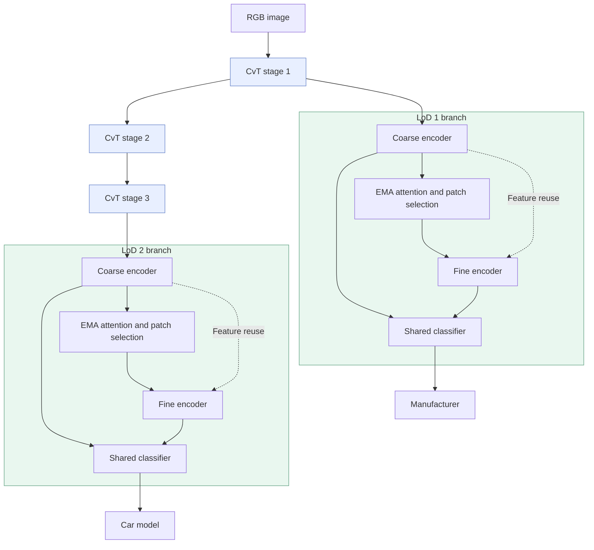

# LCvT · LoD-Aware Convolutional Vision Transformer

**Hierarchical visual recognition for digital twin synchronization.**

하나의 공유 CvT 백본과 LoD별 분기를 통해, 필요한 **Level of Detail**에 맞는 정보를 분류하는 연구입니다. CompCars에서는 LoD 1이 제조사, LoD 2가 차종에 해당합니다.

이 저장소는 저자의 `new_LCvT.py`와 같은 폴더의 `CvT_branch.py`를 대조해 **LoD1·LoD2 분기, coarse-to-fine 추론, 중요 패치 선택과 특징 재사용**을 함께 정리한 프레임워크입니다. 주석 처리되어 있던 LoD2 패치 선택도 복원했습니다. **Early exit만 제외**하며, fine 추론 요청은 항상 fine 단계까지 수행합니다.

## Paper

**A Novel Convolutional Vision Transformer Network for Effective Level-of-Detail Awareness in Digital Twins**  
Min-Seo Yang†, Ji-Wan Kim†, Hyun-Suk Lee · *Electronics*, 2025, 14(19), 3942  
† Equal contribution · [Paper](https://www.mdpi.com/2079-9292/14/19/3942) · [DOI](https://doi.org/10.3390/electronics14193942)

논문에 명시된 Min-Seo Yang의 공동 기여는 software, validation, investigation, data curation, visualization 및 writing—review and editing입니다.

## Framework

| 구성 | 역할 | 구현 |
| --- | --- | --- |
| Shared CvT backbone | convolutional token embedding과 attention으로 공통 특징 추출 | [layers.py](lcvt/layers.py) |
| LoD 1 branch | stage 1 특징으로 제조사 분류 | [model.py](lcvt/model.py) |
| LoD 2 branch | stage 3 특징으로 차종 분류 | [model.py](lcvt/model.py) |
| Coarse / fine inference | 각 LoD 안에서 두 해상도의 특징을 사용 | `LoDBranch.coarse()` / `fine()` |
| Informative patch selection | EMA class attention으로 중요한 coarse 패치를 골라 fine 토큰과 결합 | [patches.py](lcvt/patches.py) |
| Feature reuse | coarse encoder 특징을 fine 토큰에 전달 | `LoDBranch.fine()` |
| Joint training | 두 LoD의 coarse/fine cross-entropy를 합산 | [experiment.py](lcvt/experiment.py) |
| Requested-LoD routing | 요청한 LoD에 필요한 백본 단계와 해당 분기만 실행 | `forward(..., lods=...)` / `predict()` |
| Dynamic LoD transitions | 같은 이미지의 백본 특징을 저장하고 다음 LoD 요청에서 재사용 | `prepare_cache()` / `predict_from_cache()` |
| Hierarchy mapping | 세부 차종에서 상위 제조사 라벨을 유도 | `parent_labels()` |



**LoD와 coarse/fine은 다른 축입니다.** 제조사·차종은 분류 계층이고, coarse/fine은 각 분기 내부의 특징 처리 단계입니다. 공개 프레임워크에서는 `lod1_selection=true`, `lod2_selection=true`로 **두 분기의 중요 패치 선택을 모두 활성화**했습니다. 원본 생성자의 false 기본값을 실험 결과의 확정 설정으로 해석하지 않습니다.

패치 인덱스는 기본적으로 원본의 네 child 공식(`patch_mapping="source"`)을 유지합니다. 실제 coarse/fine 격자 비율에 따라 모든 대응 child를 선택하는 `"spatial"` 방식도 명시적 옵션으로 제공합니다. 두 방식의 차이와 설정 출처는 [구현 문서](docs/IMPLEMENTATION.md)에 설명했습니다.

## Repository scope

```text
lcvt/
├── lcvt/                  # model, attention, data, loss and checkpoint mapping
├── configs/compcars.json   # supplied source defaults
├── data/compcars/          # relative paths, labels and hierarchy; no images
├── docs/                  # implementation and reproducibility notes
├── tests/                 # computation and data checks
├── train.py
├── evaluate.py
├── infer.py
├── convert_checkpoint.py
├── requirements.txt
└── CITATION.cff
```

비교 모델(CNN, ResNet, ViT, CvT-only, LCvT-OC), 이전 모델 사본, 실험 노트북, Grad-CAM 도구, 데이터 이미지, 모델 가중치와 개인 경로가 포함된 로그는 제외했습니다.

## Quick start

```bash
git clone https://github.com/minseoyang/lcvt.git
cd lcvt
python -m venv .venv
# Windows: .venv\Scripts\activate
# macOS/Linux: source .venv/bin/activate
python -m pip install -r requirements.txt
python -m unittest discover -s tests -v
```

검증 환경은 Python 3.13.2, torch 2.6.0 / torchvision 0.21.0입니다. CUDA 설치는 [PyTorch 공식 안내](https://pytorch.org/get-started/locally/)를 참고하세요.

### Data and training

[CompCars 원본 데이터](https://mmlab.ie.cuhk.edu.hk/datasets/comp_cars/)의 image 디렉터리를 준비합니다. CSV에는 상대 경로와 0부터 시작하는 라벨만 들어 있습니다. [데이터 준비와 split 안내](docs/DATA.md)

```bash
python train.py --config configs/compcars.json --data-root /path/to/compcars/image --output runs/compcars
python evaluate.py --checkpoint runs/compcars/best.pt --data-root /path/to/compcars/image --csv data/compcars/evaluation.csv
python infer.py --checkpoint runs/compcars/best.pt --image /path/to/car.jpg --lod 2 --hierarchy data/compcars/hierarchy.json
```

`infer.py --lod 1`은 stage 1과 LoD1 분기만 실행해 제조사를 분류합니다. `--lod 2`는 stage 1–3과 LoD2 분기로 차종을 분류하며 LoD1 분기는 실행하지 않습니다. 기본 fine 요청에서는 coarse → 패치 선택 → fine 순서로 수행합니다. `--granularity coarse`는 coarse 출력만 명시적으로 요청하는 옵션이며, 신뢰도에 따른 early exit가 아닙니다.

### Dynamic LoD requests

학습의 `model(images)`는 두 LoD의 네 출력을 함께 계산합니다. 추론에서는 필요한 분기만 실행할 수 있고, **동일한 이미지**에서 LoD가 바뀔 때 백본 특징을 이어서 사용할 수 있습니다.

```python
from lcvt.experiment import load_model

model, _ = load_model("runs/compcars/best.pt", "cpu")
# images: the same preprocessed [B, 3, 256, 256] tensor
cache = model.prepare_cache(images)
manufacturer = model.predict_from_cache(cache, lod=1)  # stage 1 + LoD1
car_model = model.predict_from_cache(cache, lod=2)     # reuse stage 1; stage 2–3 + LoD2
```

새 이미지·프레임, 변경된 가중치나 기기에는 새 cache를 만듭니다. LoD2에서 상위 제조사 라벨을 얻을 때는 `infer.py --hierarchy`의 라벨 트리를 사용할 수 있습니다. cache는 논문 Section 4.1의 특징 재사용 흐름을 실행 API로 정리한 것이며, DT 서버나 객체 추적 시스템은 포함하지 않습니다.

### Original checkpoints

기존 `new_LCvT.py`의 `state_dict`가 있다면, 이름이 바뀐 파라미터를 명시적으로 변환할 수 있습니다. 필요한 텐서가 없거나 크기가 다르면 변환을 중단합니다. 가중치 파일은 저장소에 포함하지 않습니다.

```bash
python convert_checkpoint.py --source /path/to/original_state_dict.pt --config configs/compcars.json --output checkpoints/converted.pt
python infer.py --checkpoint checkpoints/converted.pt --image /path/to/car.jpg --lod 2
```

## Implementation status

복원한 **두 LoD 분기의 전체 경로**를 원본 `CvT_branch.py`와 같은 백본 설정·가중치로 비교했습니다. 256×256 입력에서 두 패치 선택 플래그의 네 조합 모두 네 출력이 수치적으로 일치했습니다(최대 절대 오차 6e-7 미만). CPU 테스트 11개와 합성 데이터 학습→평가→추론도 통과했습니다.

주석 속 LoD2 선택을 복원하면서 빠진 fine 위치 임베딩을 연결하고, early exit 코드 삽입으로 겹쳐진 fine loop를 제거했습니다. 원본의 중첩 residual은 유지했습니다. 체크포인트는 두 fine 위치 파라미터를 모두 포함하는 `lcvt-framework-v2`를 사용합니다. [구현 정리 내역](docs/IMPLEMENTATION.md) · [검증 조건과 재현 상태](docs/REPRODUCIBILITY.md)

## Reported results

아래는 **논문에 보고된 fine inference top-1 정확도**이며, 이 정리본에서 데이터셋 실험을 다시 수행해 얻은 결과가 아닙니다. 논문의 정확도·시간 비교에서는 early exit를 사용하지 않았습니다. [Paper, Section 5.2](https://www.mdpi.com/2079-9292/14/19/3942)

| Dataset | LoD 1 | LoD 2 |
| --- | ---: | ---: |
| CompCars | 68.68% | 74.58% |
| ImageNet | 52.23% | 55.62% |

ImageNet의 논문 실험에 필요한 정확한 split과 664-class hierarchy는 제공된 폴더에서 확인되지 않았습니다. 이 저장소의 기본 실행 안내는 CompCars를 대상으로 합니다.

## Citation

```bibtex
@article{yang2025lcvt,
  author  = {Yang, Min-Seo and Kim, Ji-Wan and Lee, Hyun-Suk},
  title   = {A Novel Convolutional Vision Transformer Network for Effective Level-of-Detail Awareness in Digital Twins},
  journal = {Electronics},
  year    = {2025},
  volume  = {14},
  number  = {19},
  pages   = {3942},
  doi     = {10.3390/electronics14193942}
}
```

Related work: CvT, CF-ViT and hierarchical classification. [Acknowledgements](docs/ACKNOWLEDGEMENTS.md)
