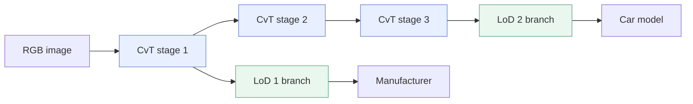

# LCvT · LoD-Aware Convolutional Vision Transformer

**Hierarchical visual recognition for digital twin synchronization.**

하나의 공유 CvT 백본과 LoD별 분기를 통해, 필요한 **Level of Detail**에 맞는 정보를 분류하는 연구입니다. CompCars에서는 LoD 1이 제조사, LoD 2가 차종에 해당합니다.

이 저장소는 저자의 `new_LCvT.py`에서 **실제 실험에 사용한 활성 코드**를 중심으로 정리했습니다. 원본의 coarse/fine 계산을 유지하며, early exit와 주석 처리된 LoD2 패치 선택은 포함하지 않습니다.

## Paper

**A Novel Convolutional Vision Transformer Network for Effective Level-of-Detail Awareness in Digital Twins**  
Min-Seo Yang†, Ji-Wan Kim†, Hyun-Suk Lee · *Electronics*, 2025, 14(19), 3942  
† Equal contribution · [Paper](https://www.mdpi.com/2079-9292/14/19/3942) · [DOI](https://doi.org/10.3390/electronics14193942)

논문에 명시된 Min-Seo Yang의 공동 기여는 software, validation, investigation, data curation, visualization 및 writing—review and editing입니다.

## Experiment framework

| 구성 | 역할 | 구현 |
| --- | --- | --- |
| Shared CvT backbone | convolutional token embedding과 attention으로 공통 특징 추출 | [layers.py](lcvt/layers.py) |
| LoD 1 branch | stage 1 특징으로 제조사 분류 | [model.py](lcvt/model.py) |
| LoD 2 branch | stage 3 특징으로 차종 분류 | [model.py](lcvt/model.py) |
| Coarse / fine inference | 각 LoD 안에서 두 해상도의 특징을 사용 | `LoDBranch.coarse()` / `fine()` |
| Feature reuse | coarse encoder 특징을 fine 토큰에 전달 | `LoDBranch.fine()` |
| Joint training | 두 LoD의 coarse/fine cross-entropy를 합산 | [experiment.py](lcvt/experiment.py) |



**LoD와 coarse/fine은 다른 축입니다.** 제조사·차종은 분류 계층이고, coarse/fine은 각 분기 내부의 특징 처리 단계입니다. 원본 기본 설정에서는 LoD1의 선택적 패치 코드도 비활성화되어 있습니다.

## Repository scope

```text
lcvt/
├── lcvt/                  # model, attention, data, loss and checkpoint mapping
├── configs/compcars.json   # supplied source defaults
├── data/compcars/          # relative paths, labels and hierarchy; no images
├── docs/                  # implementation and reproducibility notes
├── tests/                 # computation and data checks
├── train.py
├── evaluate.py
├── infer.py
├── convert_checkpoint.py
├── requirements.txt
└── CITATION.cff
```

비교 모델(CNN, ResNet, ViT, CvT-only, LCvT-OC), 이전 모델 사본, 실험 노트북, Grad-CAM 도구, 데이터 이미지, 모델 가중치와 개인 경로가 포함된 로그는 제외했습니다.

## Quick start

```bash
git clone https://github.com/minseoyang/lcvt.git
cd lcvt
python -m venv .venv
# Windows: .venv\Scripts\activate
# macOS/Linux: source .venv/bin/activate
python -m pip install -r requirements.txt
python -m unittest discover -s tests -v
```

검증 환경은 Python 3.13.2, torch 2.6.0 / torchvision 0.21.0입니다. CUDA 설치는 [PyTorch 공식 안내](https://pytorch.org/get-started/locally/)를 참고하세요.

### Data and training

[CompCars 원본 데이터](https://mmlab.ie.cuhk.edu.hk/datasets/comp_cars/)의 image 디렉터리를 준비합니다. CSV에는 상대 경로와 0부터 시작하는 라벨만 들어 있습니다. [데이터 준비와 split 안내](docs/DATA.md)

```bash
python train.py --config configs/compcars.json --data-root /path/to/compcars/image --output runs/compcars
python evaluate.py --checkpoint runs/compcars/best.pt --data-root /path/to/compcars/image --csv data/compcars/evaluation.csv
python infer.py --checkpoint runs/compcars/best.pt --image /path/to/car.jpg --lod 2 --hierarchy data/compcars/hierarchy.json
```

`infer.py --lod 1`은 제조사, `--lod 2`는 차종 출력을 선택합니다. `--granularity coarse`로 coarse 출력을 선택할 수 있습니다. **모든 백본 단계와 네 head가 계산되며**, LoD 선택에 따른 연산 생략이나 early exit는 수행하지 않습니다.

### Original checkpoints

기존 `new_LCvT.py`의 `state_dict`가 있다면, 이름이 바뀐 파라미터를 명시적으로 변환할 수 있습니다. 필요한 텐서가 없거나 크기가 다르면 변환을 중단합니다. 가중치 파일은 저장소에 포함하지 않습니다.

```bash
python convert_checkpoint.py --source /path/to/original_state_dict.pt --config configs/compcars.json --output checkpoints/converted.pt
python infer.py --checkpoint checkpoints/converted.pt --image /path/to/car.jpg --lod 2
```

## Implementation status

원본의 **early exit를 끈 실행**과 정리본에 동일한 가중치를 넣어 네 출력을 비교했습니다. 256×256 입력에서 기본 설정과 LoD1의 비주석 선택 경로 모두 수치적으로 일치했습니다. CPU 배치 1, 역전파, 체크포인트 저장·로드 및 학습→평가→추론도 확인했습니다.

출력을 임의로 바꾸지 않기 위해 원본의 중첩 residual과 LoD2 fine block의 반복 적용을 유지했습니다. 논문 표와 소스 기본값의 차이도 별도 문서에 기록했습니다. [구현 정리 내역](docs/IMPLEMENTATION.md) · [검증 조건과 재현 상태](docs/REPRODUCIBILITY.md)

## Reported results

아래는 **논문에 보고된 fine inference top-1 정확도**이며, 이 정리본에서 데이터셋 실험을 다시 수행해 얻은 결과가 아닙니다. 논문의 정확도·시간 비교에서는 early exit를 사용하지 않았습니다. [Paper, Section 5.2](https://www.mdpi.com/2079-9292/14/19/3942)

| Dataset | LoD 1 | LoD 2 |
| --- | ---: | ---: |
| CompCars | 68.68% | 74.58% |
| ImageNet | 52.23% | 55.62% |

ImageNet의 논문 실험에 필요한 정확한 split과 664-class hierarchy는 제공된 폴더에서 확인되지 않았습니다. 이 저장소의 기본 실행 안내는 CompCars를 대상으로 합니다.

## Citation

```bibtex
@article{yang2025lcvt,
  author  = {Yang, Min-Seo and Kim, Ji-Wan and Lee, Hyun-Suk},
  title   = {A Novel Convolutional Vision Transformer Network for Effective Level-of-Detail Awareness in Digital Twins},
  journal = {Electronics},
  year    = {2025},
  volume  = {14},
  number  = {19},
  pages   = {3942},
  doi     = {10.3390/electronics14193942}
}
```

Related work: CvT, CF-ViT and hierarchical classification. [Acknowledgements](docs/ACKNOWLEDGEMENTS.md)
