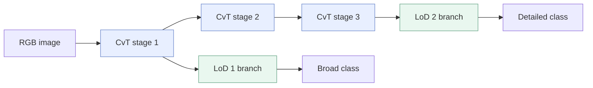
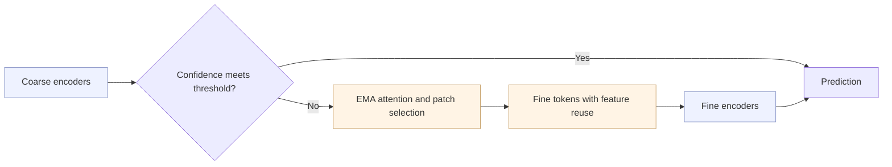

# LCvT · LoD-Aware Convolutional Vision Transformer

**Hierarchical visual recognition for adaptive digital twin synchronization.**

원하는 **Level of Detail (LoD)**에 맞춰, 하나의 모델에서 넓은 범주의 정보와 세부 정보를 구분하는 연구입니다. 공유 CvT 백본과 LoD별 ViT 분기에 coarse-to-fine 추론을 결합합니다.

> **Research code status** — 저자 연구 코드의 핵심을 정리한 reference implementation입니다. 실행 오류와 미완성 경로를 수정했으며, 원본 실험 스냅샷과 출력이 동일하지 않습니다. 논문 성능을 이 정리본으로 재현했다고 주장하지 않습니다. [원본과의 차이](docs/IMPLEMENTATION.md) · [재현 상태](docs/REPRODUCIBILITY.md)

## Paper

**A Novel Convolutional Vision Transformer Network for Effective Level-of-Detail Awareness in Digital Twins**  
Min-Seo Yang†, Ji-Wan Kim†, Hyun-Suk Lee · *Electronics*, 2025, 14(19), 3942  
† Equal contribution · [Read the paper](https://www.mdpi.com/2079-9292/14/19/3942) · [DOI](https://doi.org/10.3390/electronics14193942)

논문에 명시된 Min-Seo Yang의 공동 기여는 software, validation, investigation, data curation, visualization 및 writing—review and editing입니다.

## Core framework

| 구성 | 역할 | 코드 |
| --- | --- | --- |
| Shared CvT backbone | convolutional embedding과 attention으로 공통 특징 추출 | [layers.py](lcvt/layers.py) |
| LoD-specific branches | stage 1에서 LoD 1, stage 3에서 LoD 2 분류 | [model.py](lcvt/model.py) |
| Coarse-to-fine refinement | EMA class attention으로 중요한 coarse 패치를 선택하고 세분화 | [patches.py](lcvt/patches.py) |
| Early exit | 샘플별 coarse confidence가 임계값 이상이면 fine 연산 생략 | `LCvT.predict()` |
| Feature reuse | coarse 특징을 fine 토큰에 전달하고, LoD 변경 시 백본 특징 재사용 | `LoDBranch.fine()` / `FeatureCache` |
| Joint training | 두 LoD의 coarse/fine cross-entropy를 가중 합산 | [experiment.py](lcvt/experiment.py) |



Each LoD branch follows the same refinement procedure:



**LoD와 coarse/fine은 다른 축입니다.** CompCars에서 LoD 1은 제조사, LoD 2는 차종이며, 각 LoD 분기 안에서 coarse/fine 추론을 수행합니다. LoD 2 예측의 상위 라벨은 label tree로 얻을 수 있습니다.

## Repository scope

```text
lcvt/
├── lcvt/                # backbone, branches, patch mapping, data and loss
├── configs/             # source-dimension and paper Table 1 presets
├── data/compcars/        # relative paths, zero-based labels and hierarchy only
├── docs/                # paper-to-code mapping and reproducibility notes
├── tests/               # spatial, gradient, early-exit and cache checks
├── train.py
├── evaluate.py
├── infer.py
├── requirements.txt
└── CITATION.cff
```

비교 모델(CNN, ResNet, ViT, CvT-only, LCvT-OC), 이전 모델 사본, 실험 노트북, Grad-CAM 도구, 데이터 이미지, 체크포인트와 개인 경로가 포함된 로그는 공개 범위에서 제외했습니다.

## Quick start

Python 환경에서 아래 명령을 실행합니다. CUDA 환경은 [PyTorch 공식 설치 안내](https://pytorch.org/get-started/locally/)에서 맞는 torch/torchvision 조합을 설치하세요. 검증에 사용한 조합은 torch 2.6.0 / torchvision 0.21.0입니다.

```bash
git clone https://github.com/minseoyang/lcvt.git
cd lcvt
python -m venv .venv
# Windows: .venv\Scripts\activate
# macOS/Linux: source .venv/bin/activate
python -m pip install -r requirements.txt
python -m unittest discover -s tests -v
```

### Select an architecture preset

| Config | Backbone channels / depths / heads | 의미 |
| --- | --- | --- |
| `compcars_source_dims.json` | 64/64/64 · 3/4/5 · 3/3/3 | 제공된 `new_LCvT.py`의 기본 백본 크기 |
| `compcars_table1.json` | 64/192/384 · 3/4/4 · 1/3/3 | 논문 Table 1에서 읽은 백본 크기 |
| `imagenet_table1.json` | Table 1과 동일 · 664/1000 classes | ImageNet 실행용 구조 설정; 실제 split과 hierarchy는 별도 필요 |

모든 preset은 정리본의 수정된 실행 경로를 사용합니다. Table 1에 없는 branch 설정은 제공된 코드에서 가져왔습니다. 따라서 Table 1 preset도 검증된 논문 재현 설정은 아닙니다.

### Train and evaluate

[CompCars 원본 데이터](https://mmlab.ie.cuhk.edu.hk/datasets/comp_cars/)의 image 디렉터리를 준비합니다. 포함된 CSV는 원본 `train.txt`, `valid.txt`, `test.txt`를 그대로 변환한 상대 경로·라벨 목록입니다. 이미지 파일은 포함하지 않습니다. [데이터 안내](docs/DATA.md)

```bash
python train.py --config configs/compcars_source_dims.json --data-root /path/to/compcars/image --output runs/compcars
python evaluate.py --checkpoint runs/compcars/best.pt --data-root /path/to/compcars/image --csv data/compcars/evaluation.csv
python infer.py --checkpoint runs/compcars/best.pt --image /path/to/car.jpg --lod 2 --hierarchy data/compcars/hierarchy.json
# Enable adaptive refinement explicitly:
python infer.py --checkpoint runs/compcars/best.pt --image /path/to/car.jpg --lod 1 --early-exit --threshold 0.98
```

`forward()`는 항상 네 개의 출력을 계산합니다. 학습과 네 head의 정확도 평가에서 early exit는 비활성화됩니다. `infer.py`의 class ID는 0부터 시작하며, `coarse_confidence`는 coarse 출력의 softmax 최댓값입니다. 임계값은 검증 데이터로 따로 조정해야 합니다.

### Reuse features when LoD changes

```python
import torch
from lcvt.experiment import load_model

model, _ = load_model("runs/compcars/best.pt", "cpu")
image = torch.randn(1, 3, model.config.image_size, model.config.image_size)  # API shape example
cache = model.encode(image, lod=1)
broad = model.predict_from_cache(cache, lod=1)
detailed = model.predict_from_cache(cache, lod=2)  # executes stages 2–3, reuses stage 1
```

실제 추론에는 `lcvt.data.image_transform()`으로 전처리한 이미지를 사용합니다. cache는 **동일한 이미지와 동일한 모델 상태**에만 유효합니다. 이미지·가중치·장치·정밀도가 바뀌면 새 cache를 만드세요. DT 서버나 객체 추적 시스템은 이 저장소의 범위에 포함하지 않습니다.

## Reported results

아래는 **논문에 보고된 fine inference top-1 정확도**이며, 현재 정리본에서 측정한 결과가 아닙니다. 논문의 정확도·시간 비교는 early exit를 비활성화하고 수행했습니다. [Paper, Section 5.2](https://www.mdpi.com/2079-9292/14/19/3942)

| Dataset | LoD 1 | LoD 2 |
| --- | ---: | ---: |
| CompCars | 68.68% | 74.58% |
| ImageNet | 52.23% | 55.62% |

## Citation

```bibtex
@article{yang2025lcvt,
  author  = {Yang, Min-Seo and Kim, Ji-Wan and Lee, Hyun-Suk},
  title   = {A Novel Convolutional Vision Transformer Network for Effective Level-of-Detail Awareness in Digital Twins},
  journal = {Electronics},
  year    = {2025},
  volume  = {14},
  number  = {19},
  pages   = {3942},
  doi     = {10.3390/electronics14193942}
}
```

CvT와 CF-ViT를 기반으로 한 연구입니다. [Acknowledgements](docs/ACKNOWLEDGEMENTS.md)에서 관련 문헌과 공개 코드 정리 범위를 확인할 수 있습니다.
